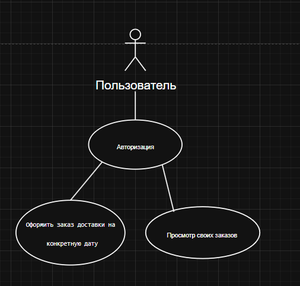
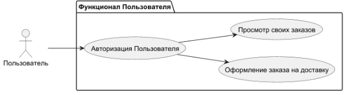
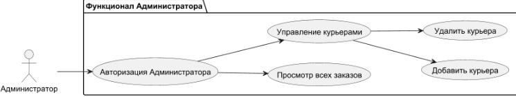
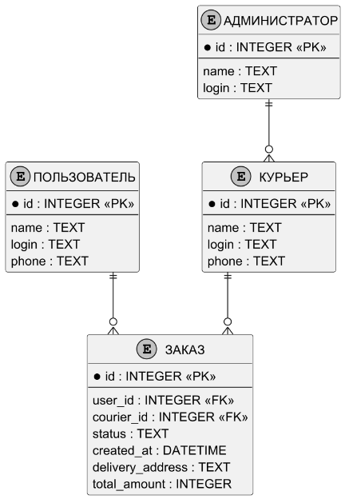
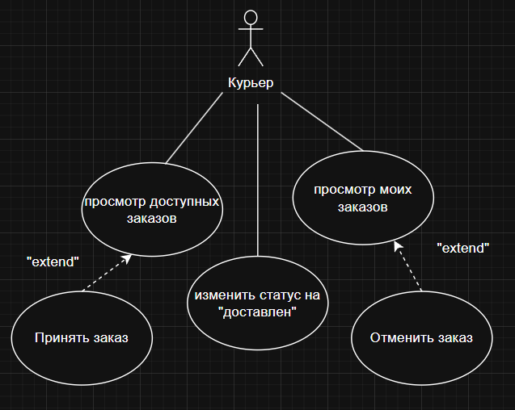
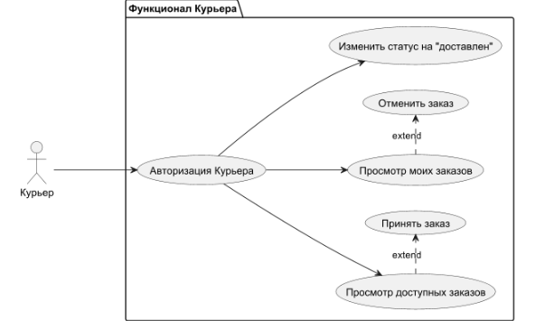

# Учет доставки заказов

## 1. Предметная область

Система предназначена для **автоматизации учёта доставки заказов** в компании. Она упрощает заказ доставки заказов для пользователей. Взаимодействие с системой осуществляется через **консольный интерфейс на Python**.

## 2. Цели системы

- **Для клиентов:** Упростить и ускорить процесс доставки заказов
- **Для администраторов:** Предоставить удобный инструмент для управления системой доставки заказов
- **Для бизнеса:** Оптимизировать процесс доставки заказов для дальнейшей эксплуатации
- **Общая цель:** Оптимизировать взаимодействие между клиентами и администрацией компании

## 3. Пользователи системы

### 👤 Клиент:
- Оформление заказа на доставку товара
- Просмотр статусов своих заказов

### 👨‍💼 Администратор:
- Просмотр и обработка всех заказов (подтверждение или отклонение)
- Возможность добавлять курьеров в систему

### 👨‍ Курьер:
- Просмотр доступных заказов
- Просмотр моих заказов
- Принять заказ
- Отменить заказ

## 4. Основные функции системы

### 🛒 Функционал для клиента:
1. **Оформление заказа** - Создание новой заявки на заказ выбранного товара
2. **Мои заказы** - Просмотр списка всех своих заказов с текущими статусами
 

### ⚙️ Функционал для администратора:
1. **Работа с заявками** - Просмотр всех заявок от клиентов, их подтверждение или отклонение
2. **Добавление курьеров** - Возможность добавлять курьеров в систему
 

### ⚙️ Функционал для курьера:
1. **Работа с заказами** - Возможность принять и отклонить заказ.
 

## 5. Архитектура и способы реализации

Система построена по принципу **трёхуровневой архитектуры (3-Tier Architecture)**:

### 🎯 Presentation Layer (Уровень представления)
- Консольный интерфейс на Python
- Текстовое меню для выбора действий

### ⚡ Business Logic Layer (Бизнес-логика)
- Модуль с основными функциями системы
- Обработка заказов
- Управление статусами заказов
- Другие бизнес-процессы

### 💾 Data Layer (Уровень данных)
- Реляционная база данных (SQLite)
- Хранение информации о заказах, клиентах и курьерах
